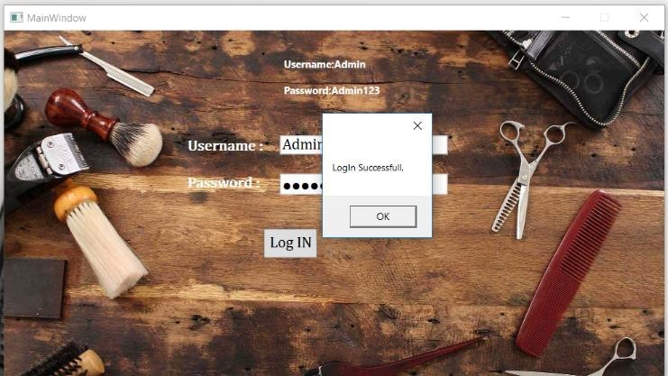

# Crayons-Hair-Saloon

-- General Information --

This system is made for saloon shop for the process of booking appointment.
This system allows user to book an appointment with different criteria and helps user to view booked appointment.

Login page: First page where user login to the system with the help of user id and password.

Home Page: here user can book appointment by clicking Book an Appointment button and can view booked appointments. And with help of logout button, he will go to login page.

Book an Appointment Page: Here user can enter customer details like user name, appointment slot, email id, contact number, gender and selection choices.

User must enter all field with valid input. Like user can not enter more than 90 in age field, not more than 10 digits in contact number.

After entering all data user can see all information that he entered in for book appointment. If all information is correct then user must click confirm Appointment to save appointment of customer.

View Booked Appointment: User can view all the booked appointments and with the help of search bar user can find appointment by the name of customer.

Search client details for an appointment

